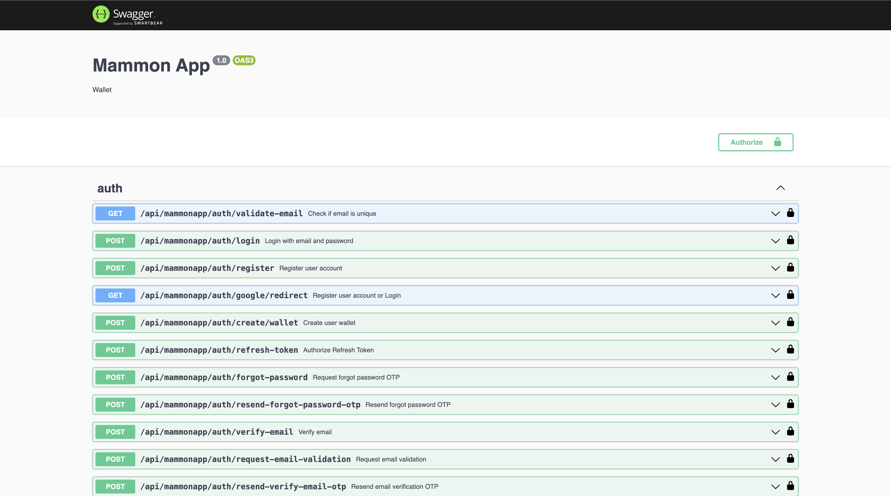

# Mammon App Backend


## Overview

The **Mammon App Backend** is a robust financial system built on **Stellar Blockchain** using **NestJS**, with **MongoDB** as its database. 
It incorporates **RabbitMQ** for message queuing, **Redis** for caching, **AES-256-CBC** and **CryptoJS** for encryption, 
and **Nodemailer** for email notifications. The backend also supports **Swagger** for API documentation, **Soroban Stellar** for blockchain transactions, 
and **Cloudinary** for image storage. Our team has built this system to address the need for secure, decentralized financial services, 
supporting both fiat and crypto transactions for cross-border payment.

## Problem Statement

Despite the growing adoption of **cryptocurrencies** for cross-border payments, converting **crypto to fiat and vice versa** remains one of 
the **biggest bottlenecks** in Nigeria and across West Africa. While sending crypto is **instant and low-cost**, the challenge lies 
in **accessing local currency**, as most businesses and individuals still rely on fiat for everyday transactions.  

### **The Current Struggle: P2P and Informal Channels**  

Without **seamless fiat on-ramps and off-ramps**, users are **forced to rely on risky, inefficient methods** to exchange crypto for their local currency:  

- **Peer-to-Peer (P2P) Trading**: Many users have to **search for individuals** willing to exchange their crypto for cash, often through **social media groups** 
or informal marketplaces. This method is **slow**, prone to **scams**, and offers **unfavorable exchange rates**.  
- **Physical Brokers & Black Market Dealers**: Some people rely on **local currency exchangers** in physical locations. These middlemen **inflate rates**, 
charge **hidden fees**, and are **not always reliable**.  
- **Limited and Unreliable Crypto-Fiat Gateways**: Most traditional banks and payment providers **do not support crypto**, making it difficult to deposit 
or withdraw funds **directly** from a regulated platform. Even where services exist, **withdrawals are often delayed** and subject to **sudden restrictions**.  
- **Regulatory Uncertainty**: Crypto regulations in Nigeria and West Africa are **inconsistent**, with periodic **banking bans and government crackdowns**, 
making it even harder to access fiat liquidity.  

These challenges **restrict financial inclusion**, making it difficult for businesses and individuals to **fully leverage cryptocurrency for real-world payments and international transactions**.  


## **How Stellar Blockchain Solves This Problem**  

The **Stellar Blockchain** provides a **reliable, low-cost, and decentralized** solution for **seamless crypto-to-fiat and fiat-to-crypto transactions**. 
By leveraging Stellar’s **anchor network** and **decentralized exchange (SDEX)**, Mammon enables users to:  

✅ **Instantly swap crypto for fiat without needing middlemen.**  
✅ **Access stable exchange rates with transparent pricing.**  
✅ **Deposit and withdraw fiat directly from integrated financial partners.**  
✅ **Eliminate the risks of P2P trading and unreliable brokers.**  
✅ **Enjoy low-cost transactions with real-time settlement.**  

With **Mammon’s integration of Stellar**, users will no longer have to **struggle to find P2P traders, negotiate black market rates, or worry about liquidity issues**. 
Instead, they will have **direct access to a seamless, borderless financial system** that **bridges crypto and fiat efficiently**.  

Our **backend architecture** ensures **secure wallet management, fast transaction processing, and regulatory compliance**, making cross-border payments truly accessible to everyone.  


## Technical Architecture and Implementation Details

Our backend is built using a **microservices** architecture with a focus on modularity and scalability. 
The system integrates various technologies to ensure high availability and security:

- **NestJS**: Used for building the backend API with high performance and scalability in mind.
- **MongoDB**: A NoSQL database used to store user and transaction data, ensuring high performance and flexibility.
- **RabbitMQ**: Message broker for communication between microservices, enabling asynchronous processing of tasks such as notifications.
- **Redis**: Used as a caching layer to speed up frequently accessed data and improve overall performance.
- **AES-256-CBC & CryptoJS**: Employed to securely encrypt sensitive data like user passwords and private keys.
- **Nodemailer**: Sends email notifications for important actions like successful transactions or account activity.
- **Stellar Blockchain**: For performing decentralized financial transactions, including sending and receiving cryptocurrency.
- **Cloudinary**: Provides image storage and retrieval functionality for user profile pictures and other media assets.

The backend communicates with the **Stellar** blockchain for transaction processing and employs **JWT-based authentication** to secure user data and access.

## Justification for Technical Decisions and Approaches Taken

- **Stellar Blockchain**: We chose Stellar due to its low-cost, fast transaction processing, and high scalability, making it an ideal choice for cross-border payments.
- **NestJS**: Chosen for its modular design, scalability, and strong support for TypeScript, which ensures maintainable and type-safe code.
- **MongoDB**: Provides flexibility in handling complex, unstructured data, while supporting horizontal scalability to meet growing user demands.
- **AES-256-CBC**: This encryption standard is widely regarded as one of the most secure encryption algorithms, ensuring that sensitive user data, like passwords, remains protected.
- **Redis**: Implemented for caching frequently accessed data to reduce response times and enhance the overall performance of the application.
- **RabbitMQ**: A message broker that allows us to process background tasks like notifications asynchronously, improving scalability and responsiveness.

The overall architecture is designed for modularity, with different services (e.g., authentication, transactions, notifications) operating independently, allowing for better maintenance and scalability.

## Team's Experience with Development on Stellar

Our team has extensive experience developing blockchain applications, particularly on the **Stellar Network**. 
We have successfully integrated Stellar’s distributed ledger technology to facilitate secure, fast, and low-cost transactions. 
We have worked with the **Stellar SDK** and **Soroban Stellar** to handle wallet management, transaction signing, and interaction with Stellar’s public and test networks. 
We have also built decentralized applications (dApps) and smart contracts to automate processes and ensure the integrity of financial transactions.

## Deployment and Testing Instructions

### Prerequisites

Ensure you have the following installed on your machine:

- Node.js (latest LTS version recommended)
- MongoDB
- Redis
- RabbitMQ

### Installation Steps

1. **Clone the Repository:**
   ```sh
   git clone https://github.com/mammon-app/backend.git
   cd backend
   ```
2. **Install Dependencies:**
   ```sh
   npm install
   ```
3. **Set Up Environment Variables:**
   - Create a `.env` file in the root directory if you have none.
   - Add the necessary environment variables (database connection, API keys, and configurations). 
   
Below is the list of environment variables that should be added to your `.env` file.

### Environment Variables

- **NODE_ENV**: Set this to the environment in which the application is running (e.g., `development`, `production`).
- **PORT**: Define the port number the backend will run on.
- **APP_NAME**: The name of the application.
- **CLIENT_URL**: The URL of your client-side frontend application.
- **TELEGRAM_COMMUNITY_URL**: URL for your Telegram community.
- **X_URL**: The URL to your X (formerly Twitter) profile or application.
- **JWT_SECRET**: Secret key used for signing JWT tokens for authentication.
- **JWT_REFRESH_SECRET**: Secret key for signing JWT refresh tokens.
- **SECRET**: General-purpose secret key used for various cryptographic functions.
- **API_KEY**: The API key for interacting with third-party services or the backend API.
- **NODE_TLS_REJECT_UNAUTHORIZED**: TLS (SSL) certificate validation setting (`0` or `1`).
- **ENCRYPTION_KEY**: The key used for encrypting sensitive data, like passwords.

- **PRODUCTION_DB_URL**: The URL for your production database.
- **DEV_DB_URL**: The URL for your development database.
- **STAGING_DB_URL**: The URL for your staging database.

- **EMAIL_PASSWORD**: The password used for email authentication via SMTP.
- **EMAIL_HOST**: The email server host.
- **EMAIL_PORT**: The port number of the email server.
- **EMAIL_USERNAME**: The username for email authentication.

- **DEV_REDIS_HOST**: The host for the Redis server in the development environment.
- **DEV_REDIS_PORT**: The port number for the Redis server in the development environment.
- **DEV_REDIS_PASSWORD**: The password for Redis in the development environment.
- **DEV_REDIS_URL**: The URL for the Redis server in the development environment.
- **PRODUCTION_REDIS_HOST**: The host for the Redis server in the production environment.
- **PRODUCTION_REDIS_PORT**: The port number for Redis in the production environment.
- **PRODUCTION_REDIS_PASSWORD**: The password for Redis in the production environment.

- **DEV_RABBITMQ_URL**: The URL for RabbitMQ in the development environment.
- **DEV_RABBITMQ_NOTIFICATION**: Notification configuration for RabbitMQ in the development environment.
- **DEV_RABBITMQ_QUEUE_NAME**: The name of the RabbitMQ queue in the development environment.
- **PRODUCTION_RABBITMQ_URL**: The URL for RabbitMQ in the production environment.
- **PRODUCTION_RABBITMQ_NOTIFICATION**: Notification configuration for RabbitMQ in the production environment.
- **PRODUCTION_RABBITMQ_QUEUE_NAME**: The name of the RabbitMQ queue in the production environment.

- **SWAGGER_API_ROOT**: The root path for Swagger API documentation.
- **SWAGGER_API_NAME**: The name of the API in the Swagger documentation.
- **SWAGGER_API_DESCRIPTION**: Description of the API in Swagger.
- **SWAGGER_API_CURRENT_VERSION**: The current version of the API.

- **STELLAR_NETWORK**: The Stellar network to use (typically `public` or `test`).
- **PRIVATE_KEY**: The private key for Stellar transactions.
- **STELLAR_ADMIN_DESTINATION_ADDRESS**: The Stellar destination address for transactions.
- **AUTH_DURATION**: The duration for which authentication tokens are valid.
- **HOME_DOMAIN**: The home domain for Stellar network operations.
- **HOME_DOMAIN_SHORT**: A short version of your home domain.
- **WEB_AUTH_ENDPOINT**: The endpoint for web authentication.
- **ASSET_CODE**: The asset code for transactions on the Stellar network.
- **SECRET_KEY**: The secret key used for authentication and transactions.
- **AUTH_KEY**: Key for authenticating Stellar services.
- **NGNC_ISSUER**: Issuer of the NGNC asset on the Stellar network.
- **STELLAR_PUBLIC_SERVER**: The URL for the public Stellar server.
- **STELLAR_TESTNET_SERVER**: The URL for the Stellar testnet server.
- **TIMEOUT**: The timeout duration for API calls or transactions.
- **FEE**: The transaction fee for Stellar operations.
- **HORIZON_MAINNET_URL**: The Horizon API URL for the Stellar mainnet.
- **HORIZON_TESTNET_URL**: The Horizon API URL for the Stellar testnet.
- **FUNDING_KEY_PUBLIC**: The public key for the funding account.
- **FUNDING_KEY_SECRET**: The secret key for the funding account.
- **FUNDING_TESTNET_KEY_SECRET**: The secret key for the funding account on the testnet.

4. **Start Required Services:**

   ```sh
   redis-server
   rabbitmq-server
   ```

5. **Run the Application:**
   ```sh
   npm run start:dev
   ```

## API Documentation

Swagger documentation is available at:

```
http://localhost:{PORT}/api/mammonapp/docs
```

Replace `{PORT}` with the actual port number defined in your `.env` file.

## Security Measures

- **Encryption:** All sensitive data is encrypted using **AES-256-CBC**.
- **Token-based Authentication:** JWT tokens ensure secure API access.
- **Role-based Access Control:** Different user roles with permission restrictions.
- **Rate Limiting & DDOS Protection:** Prevents abuse and ensures stability.

## Deployment and Testing

We deployed the backend on a **Linux server**

using **Docker** for containerization. Continuous integration and deployment (CI/CD) were set up with **GitHub Actions** to automatically build, test, and deploy changes.

## Future Plans

- Expand cross-border payment capabilities with additional blockchain networks.
- Implement decentralized finance (DeFi) protocols for improved financial services.
- Enhance user interface (UI) for a more intuitive experience.

### Concluding Remarks

The **Mammon App** is designed to create financial inclusion by leveraging the power of blockchain to simplify cross-border payments. 
The application ensures secure, fast, and cost-effective transactions, bridging the gap between fiat currencies and cryptocurrencies.